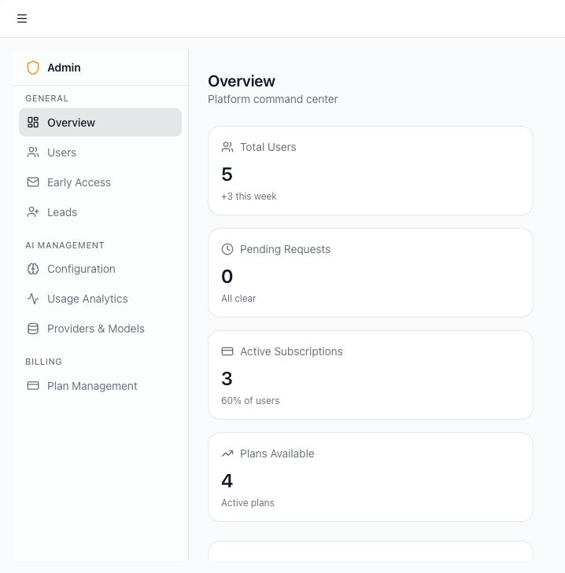
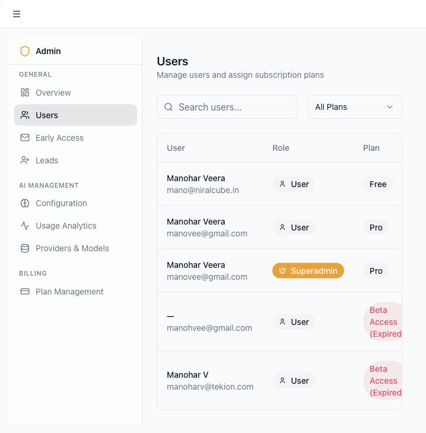
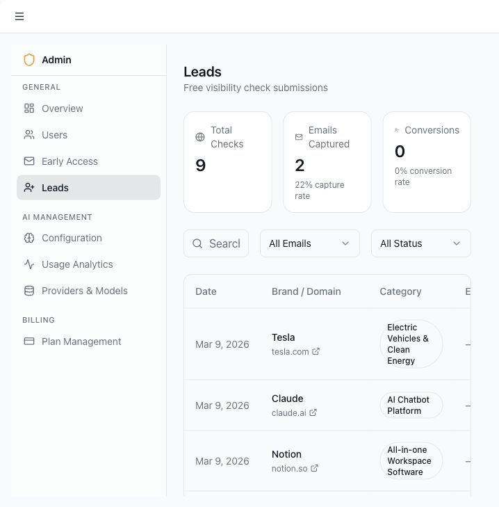
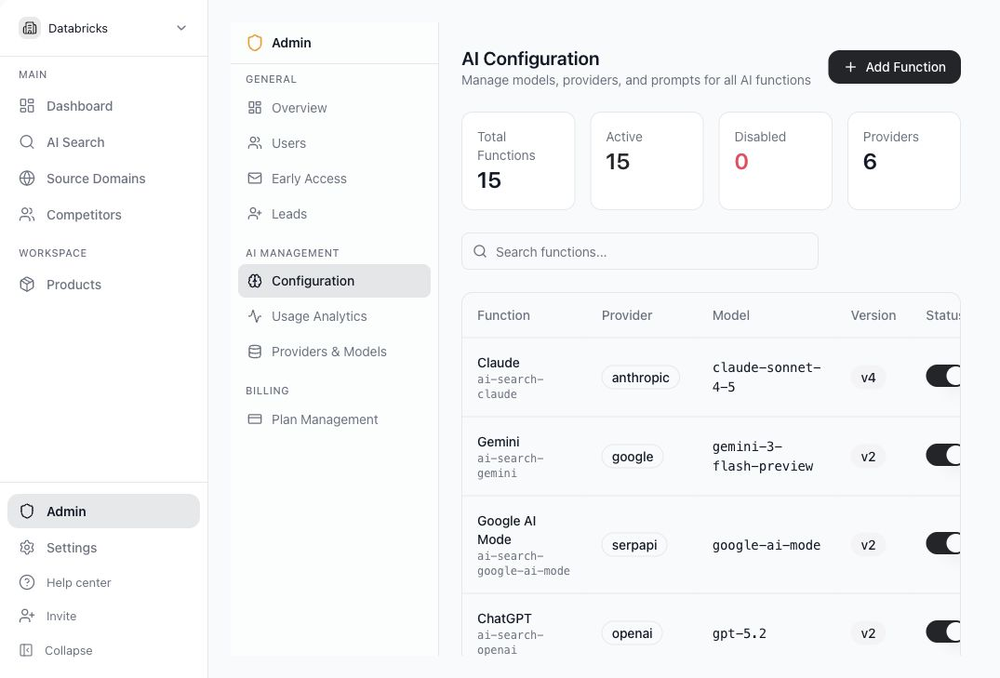
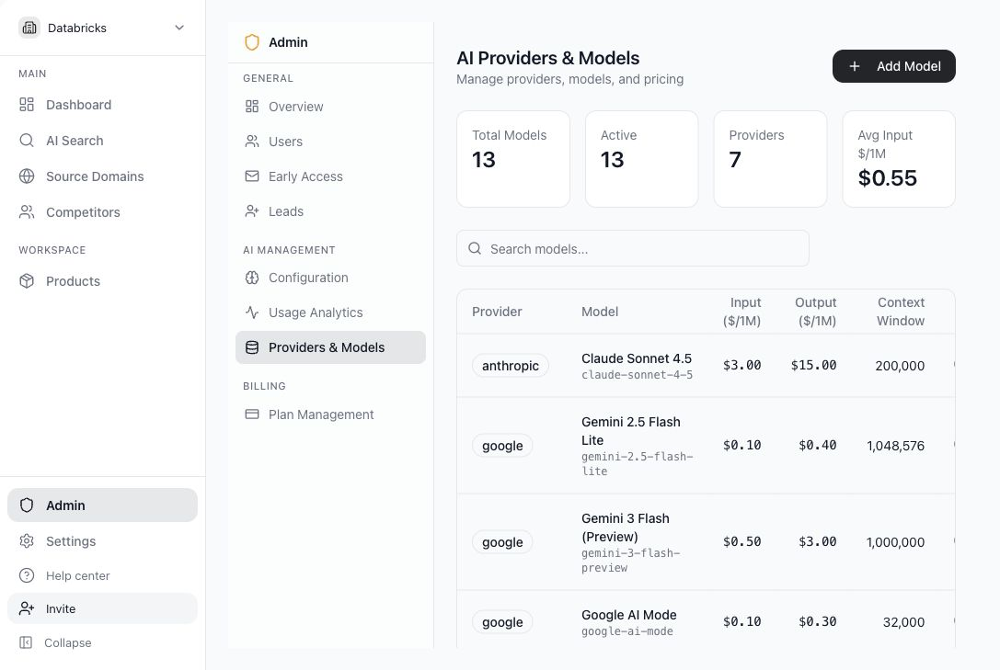
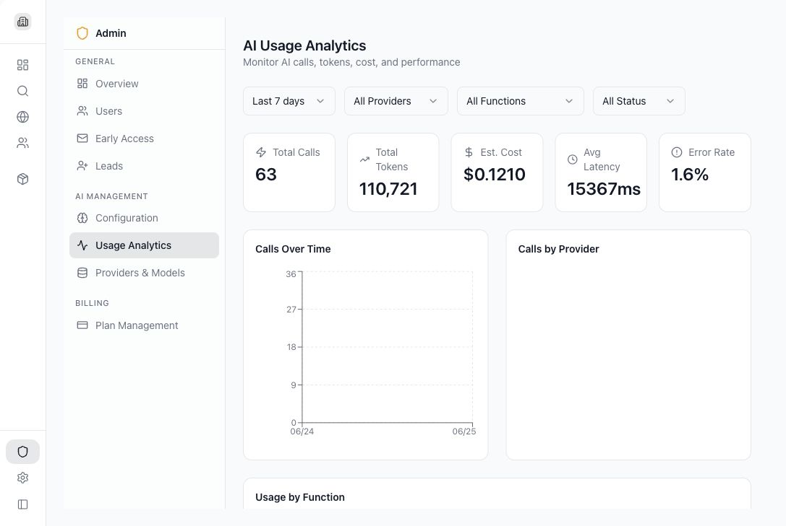

# Use the Admin console

The Admin console is for platform admins and superadmins. Regular workspace members will not see this section.

## Use cases

- Review platform activity.
- Manage users and plans.
- Approve or reject early access requests.
- Review leads from public flows.
- Configure AI workflows.
- Manage AI providers and models.
- Monitor AI usage and errors.
- Manage subscription plans.

## Open Admin

1. Sign in as a superadmin.
2. Select **Admin** in the sidebar.
3. Choose a section from the Admin sidebar.

## Overview

Overview shows total users, pending requests, active subscriptions, available plans, plan distribution, and recent activity.

## Users

Use **Users** to search users, inspect role and plan status, and assign plans.

## Early Access and Leads

Use **Early Access** for approval workflows and **Leads** to review captured leads from public flows.

## AI Configuration

Use **Configuration** to manage which AI provider and model powers each AI workflow. Only change these settings if you understand the effect on costs, quality, and reliability.

Common workflows include prompt suggestions, AI search, sentiment analysis, product analysis, competitor suggestions, optimization plans, and search ranking support.

## Providers and Models

Use **Providers & Models** to manage model availability, provider assignment, enabled status, usage limits, context windows, and cost values. Disabled models should not be used for new configured runs.

## Usage Analytics

Use **Usage Analytics** to inspect AI activity, provider mix, workflow usage, slow calls, and recent errors. This is the main support screen for understanding whether AI workflows are running successfully.

## Plan Management

Use **Plan Management** to create or update plan limits and pricing. Plan settings affect prompt limits and available workspace capacity.

## Admin safety tips

- Review plan changes before applying them because they can affect workspace limits.
- Keep AI provider settings stable unless you are intentionally changing cost, quality, or reliability.
- Use Usage Analytics first when investigating failed or slow AI workflows.
- Limit Admin access to trusted platform operators.
- Record major provider or plan changes so support can connect user reports to recent configuration changes.
