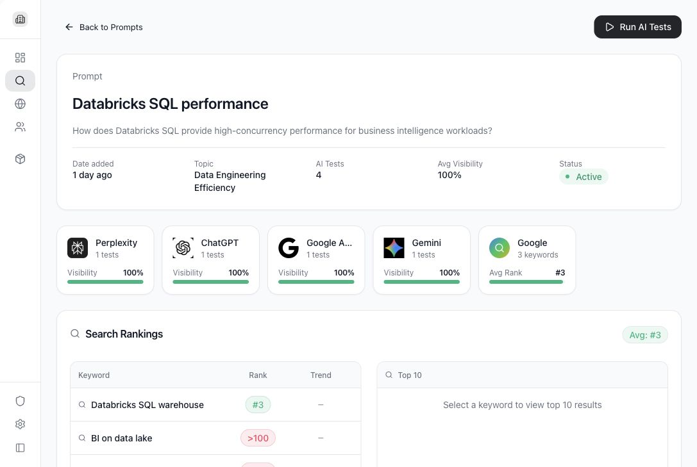

# Run AI tests and read prompt results

AI tests send a saved prompt to supported AI models and store each model response for analysis.

## Use cases

- See which AI models mention the brand.
- Compare answers from ChatGPT, Gemini, Perplexity, Claude, and Google AI Mode where configured.
- Review sentiment, citations, competitor mentions, and search ranking context.
- Rerun a prompt after changing the prompt or company settings.
- Generate optimization actions from weak or missing visibility.

## Open a prompt result

1. Go to **AI Search**.
2. Select a prompt row.
3. Review the prompt detail page.

## Run AI tests

1. Open a prompt detail page.
2. Select **Run AI Tests**.
3. Wait for model responses to complete.
4. Review the updated visibility and model result sections.

## What each result means

- **AI Tests**: number of model responses stored for this prompt.
- **Avg Visibility**: how often the company appeared in the responses.
- **Status**: whether the prompt is active.
- **Model cards**: per-model visibility and response counts.
- **Google search rankings**: keyword ranking results associated with the prompt.
- **Sentiment breakdown**: how positive, neutral, or negative the stored answers are.
- **Brand visibility**: whether the company was mentioned relative to other brands.
- **Sources**: citations extracted from AI responses.

## View a response

Open an individual AI response when you need to inspect the full answer, source citations, brand mentions, or sentiment details.

## Optimization plans

When available, optimization actions help translate weak visibility into content or source-improvement work. Use these actions as guidance for what to publish, update, or promote.

## What Tamlr saves from a test

- The prompt that was tested.
- The AI model that answered.
- The full answer text.
- Whether your company and tracked competitors were mentioned.
- Source citations found in the answer.
- Sentiment and visibility signals used in dashboards and reports.

This saved history lets your team compare results over time instead of relying on one-off AI searches.
