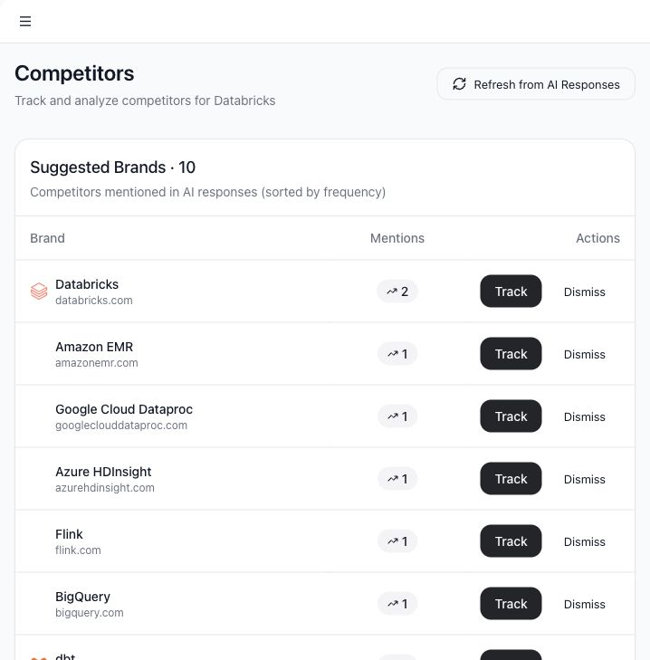

# Track competitors

Competitors helps you monitor brands that appear in AI answers alongside or instead of your company.

## Use cases

- Track known competitors.
- Discover competitors mentioned by AI models.
- See which suggested brands appear most often.
- Dismiss irrelevant suggestions.
- Refresh suggestions after running more AI tests.

## Open Competitors

1. Select **Competitors** in the sidebar.
2. Review tracked competitors and suggested brands.

## Suggested brands

Suggested brands are extracted from AI response metadata when possible. If Tamlr does not find enough competitor mentions in stored responses, it can generate suggestions from company context.

Each suggested brand can be:

- **Tracked**: add it to the competitor list.
- **Dismissed**: remove it from suggestions.

## Refresh from AI responses

Use **Refresh from AI Responses** after running more prompts. Tamlr scans recent response metadata and updates suggestions based on brands mentioned in those answers.

## Tracked competitors

Tracked competitors help other areas of the app classify source domains and compare visibility. Keeping this list clean improves dashboard comparisons and gap analysis.

## Behind the scenes

- Frontend route: `/app/competitors`.
- Frontend screen: `CompetitorsPage`.
- Backend tables: `competitors`, `ai_interactions`, and `competitor_mentions`.
- Backend functions: `generate-competitors` and `scan-competitor-mentions`.
- Competitor suggestions can come from stored response metadata or from AI generation when no response-derived suggestions are available.

