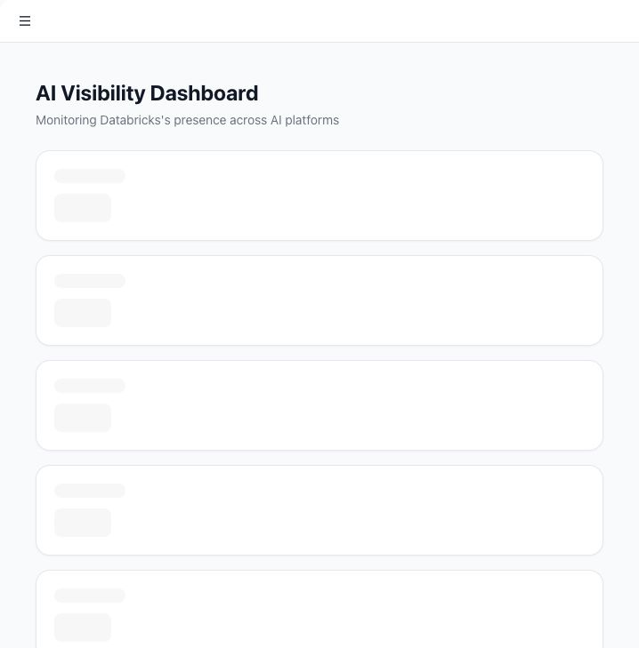

# Read the AI Visibility Dashboard

The dashboard is the workspace overview for a selected company. It summarizes how the brand is performing across prompts, AI models, citations, competitors, and Google ranking checks.

## Use cases

- See whether the brand is appearing in AI answers.
- Track visibility changes over time.
- Compare brand and competitor visibility.
- Identify the sources AI models cite most.
- Spot whether Google ranking checks are improving or declining.

## Open the dashboard

1. Sign in.
2. Select the company you want to analyze.
3. Open **Dashboard** from the sidebar.

## Metrics

The dashboard can show:

- **AI Visibility Score**: percent of AI test responses that mention the selected company.
- **Total Prompt Runs**: number of AI test responses in the current data window.
- **Mentions**: responses where the company was found.
- **Citations**: source links found in AI responses.
- **Sentiment**: average sentiment score for responses with sentiment data.
- **Avg. Google Rank**: average ranking for tracked search keywords.

## Trends and charts

- **Visibility Trend** shows daily visibility movement.
- **Google Ranking Trend** shows ranking movement, with lower rank numbers being better.
- **Brand Visibility** compares the company and competitors.
- **Top Sources** and **Source Domains** show where AI models are getting their evidence.

## Why the dashboard may show little or no data

The dashboard depends on completed AI tests and search ranking checks. If the workspace has no prompts, no recent AI tests, or no source citations, some cards and charts will be empty.

To populate the dashboard:

1. Create prompts.
2. Run AI tests.
3. Wait for responses and sentiment analysis to finish.
4. Return to the dashboard.

## How Tamlr calculates this view

- Visibility is based on completed AI test responses for the selected company.
- A mention counts when Tamlr finds the company in an AI answer.
- Citations come from source links found in AI answers.
- Sentiment comes from Tamlr's analysis of the answer tone.
- Ranking charts use completed Google ranking checks connected to prompts.

The dashboard focuses on recent workspace activity. Run fresh AI tests when you need the numbers to reflect current market visibility.
