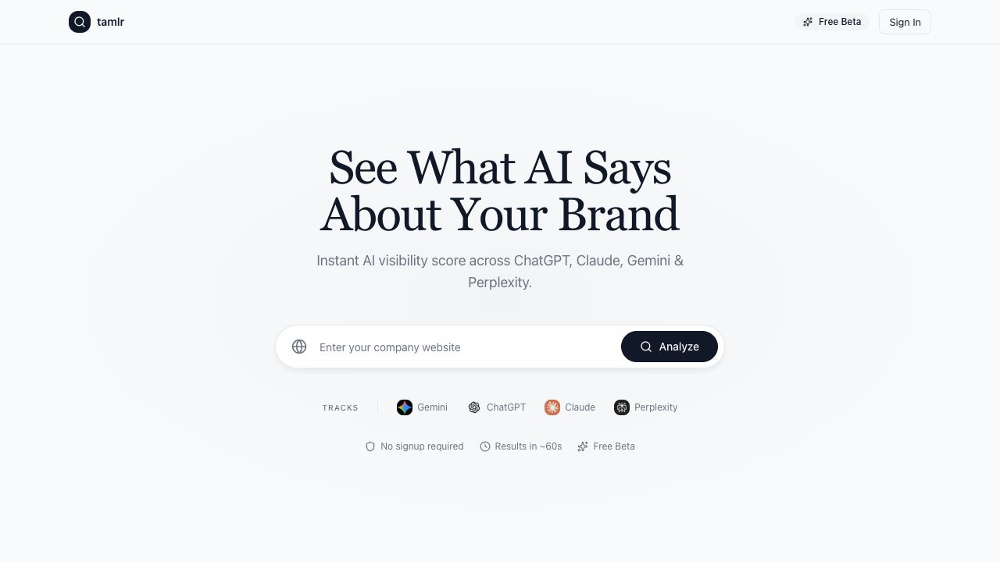

# Run a free AI visibility check

The free AI visibility check lets a visitor test how visible a brand is in AI-generated answers before creating a full workspace.

## Use cases

- Check whether AI models mention a brand for common buyer questions.
- Preview the kind of visibility report Tamlr creates.
- Capture an email before downloading or unlocking more report detail.
- Convert a report into a full workspace after sign-up.

## Start a check

1. Open the free AI visibility check page.
2. Enter the company website.
3. Select the button to start the check.
4. Tamlr detects the brand and generates suggested prompts.

If a recent report already exists for the same domain, Tamlr can return the cached report instead of running a new analysis.

## Select prompts

After detection, Tamlr shows generated prompts. Select the prompts you want to analyze. The report works best when the selected prompts reflect real questions a buyer or researcher would ask an AI tool.

## Run the analysis

Tamlr analyzes the selected prompts across the supported free-check model set. The progress view shows which model checks are pending, running, done, or failed.

## Read the report

The report focuses on:

- **AI Visibility Score**: how often the brand appears in AI answers.
- **Mentions**: number of responses that mention the brand.
- **Sentiment**: whether the brand is described positively, neutrally, or negatively.
- **Citations and sources**: the websites AI answers rely on.
- **Locked sections**: deeper analysis available after email capture or signup.

## Download the report

Use the download option when available. Tamlr renders a report view and exports it as a PDF.

## Convert the report into a workspace

If you sign up from a free report flow, Tamlr can carry selected prompt context into your account so you do not have to start from scratch.

## What happens after you submit

- Tamlr reads the website to identify the brand and useful company context.
- Tamlr suggests buyer-style prompts that can reveal whether the brand appears in AI answers.
- The selected prompts are checked across the available free-check models.
- The report summarizes visibility, mentions, sentiment, citations, and source patterns.
- If the same website was checked recently, Tamlr may reuse the recent report to avoid duplicate runs.

If you create a workspace from the report, Tamlr can carry over useful prompt context so your team has a faster starting point.