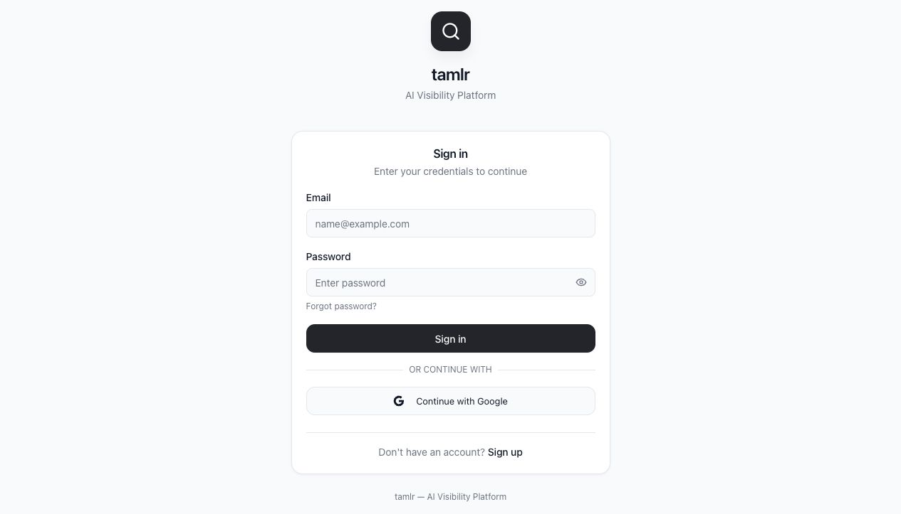

# Get started with Tamlr

Tamlr helps teams understand how visible their brand is in AI answers. You create or join a company workspace, add prompts that represent buyer questions, run tests across AI models, and review visibility, sentiment, citations, competitors, and search rankings.

## Who this is for

- Team members who need to monitor brand visibility in AI responses.
- Workspace admins who manage company details, team access, and CMS connections.
- Platform admins who manage plans, users, AI providers, and usage.

## Sign in

1. Open the Tamlr sign-in page.
2. Enter your email and password.
3. Select **Sign in**.
4. Use **Continue with Google** if your account is configured for Google sign-in.

If you are already signed in, Tamlr takes you straight to your workspace.

## Reset your password

1. Select the password reset option from the sign-in flow.
2. Enter your account email.
3. Follow the email instructions.
4. Return to Tamlr and sign in with the new password.

## Create or join a company

New users must belong to a company before they can use the workspace.

1. After sign-in, Tamlr checks whether your account has a company.
2. If you have a pending invite, choose **Join**.
3. If you need a new workspace, create a company with its name, industry, location, and website.
4. Use **Global** when the brand operates globally and Google checks should not be restricted to one country.

## Switch companies

Use the company switcher at the top of the sidebar to move between workspaces you belong to. Each company has its own prompts, products, competitors, sources, analytics, team members, and settings.

## Main navigation

After login, the sidebar gives access to:

- **Dashboard**: visibility metrics and trends.
- **AI Search**: prompts and AI tests.
- **Source Domains**: sources cited by AI responses.
- **Competitors**: tracked and suggested competitor brands.
- **Products**: products, services, or offerings used in AI context.
- **Settings**: company profile, team, account, appearance, connections, and help.
- **Admin**: platform administration, visible only to superadmins.

## What Tamlr remembers

- Your signed-in session, so you do not have to log in again every time.
- The company workspace you selected most recently.
- Which companies you can access, based on your team memberships and invites.
- Each workspace's own prompts, products, competitors, sources, team, and settings.

If something looks missing after sign-in, first check that you selected the right company in the sidebar.