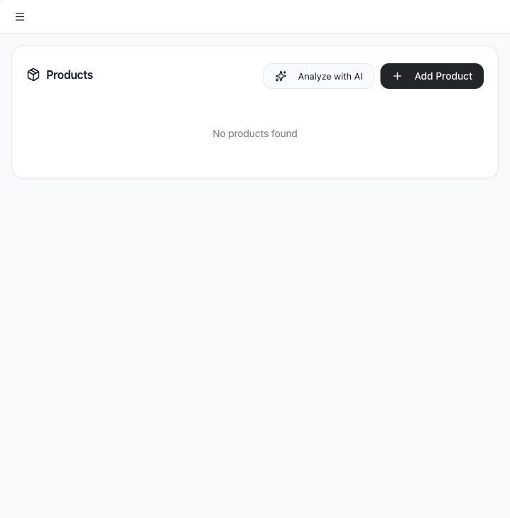
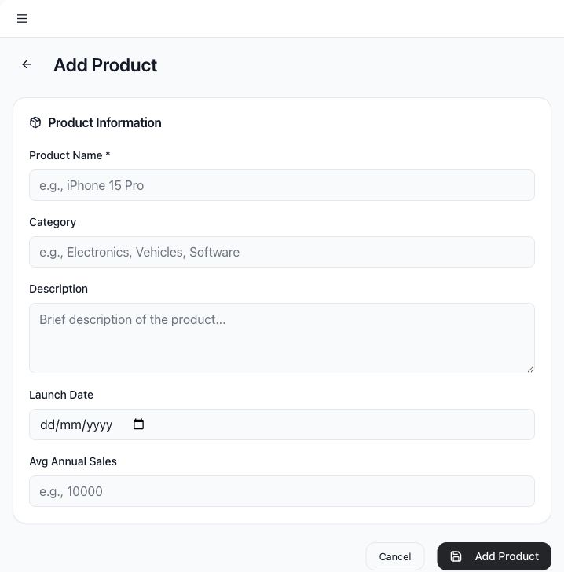

# Manage products and offerings

Products represent the products, services, or offerings your company wants Tamlr to understand. Product data helps prompt strategy and AI analysis stay specific.

## Use cases

- Add products or services manually.
- Use AI to discover offerings from a website.
- Edit product details.
- Remove outdated products.
- Give Tamlr more context for prompt generation and analysis.

## Open Products

1. Select **Products** in the sidebar.
2. Review the current product list.

## Add a product manually

1. Select **Add Product**.
2. Enter **Product Name**.
3. Add **Category**.
4. Add a short **Description**.
5. Add **Launch Date** if relevant.
6. Add **Avg Annual Sales** if useful for prioritization.
7. Select **Add Product**.

## Analyze with AI

Use **Analyze with AI** to discover products from a website.

1. Select **Analyze with AI**.
2. Confirm or enter the website URL.
3. Wait for Tamlr to analyze the site.
4. Review discovered products.
5. Select which products to import.
6. Import the selected products into the workspace.

If no products are found, add products manually or try a more complete website URL.

## Edit or delete products

Use the action buttons on a product row to edit details or delete the product. Deleting a product removes it from the product list and cannot be undone from the UI.

## How products help Tamlr

- Products give Tamlr better context for prompt ideas and analysis.
- Product names help teams monitor specific offerings, not just the overall brand.
- Categories make it easier to compare related products or services.
- Website analysis can save time, but manually reviewing imported products keeps the workspace accurate.

Update products when your offering changes so future prompts and reports stay relevant.
