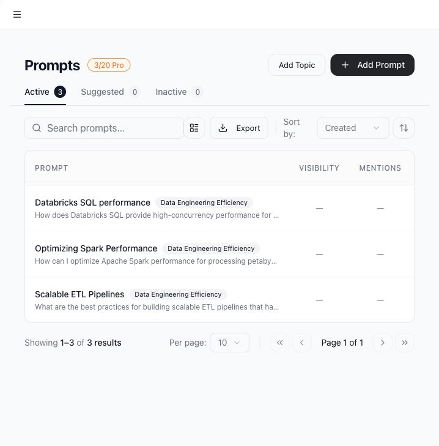
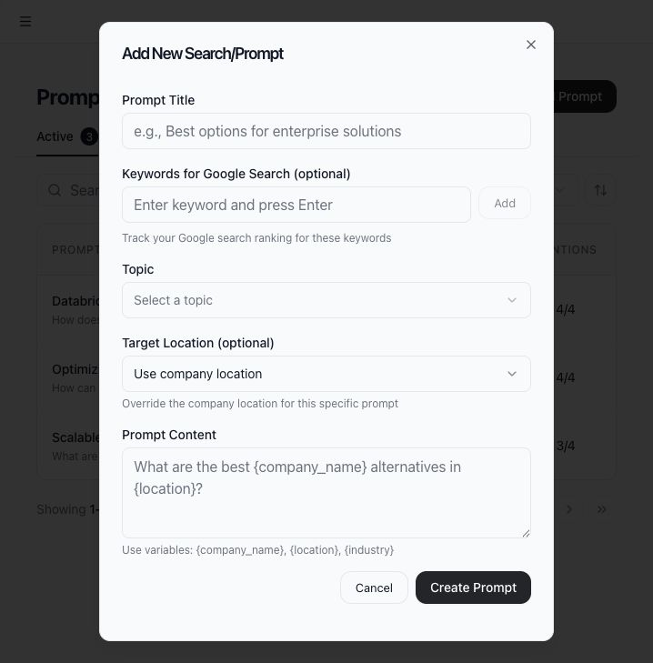

# Create and manage prompts

Prompts are the buyer, researcher, or evaluator questions that Tamlr tests across AI models. Good prompts should sound like questions someone would naturally ask ChatGPT, Gemini, Perplexity, or another AI answer engine.

## Use cases

- Track whether AI models recommend or mention your brand.
- Monitor specific buyer questions by product, location, use case, or competitor.
- Generate suggested prompt topics from company context.
- Group prompts by topic.
- Export the prompt list.
- Deactivate old prompts without deleting historical results.

## Open prompts

1. Select **AI Search** in the sidebar.
2. Use the **Active**, **Suggested**, and **Inactive** tabs to switch prompt views.

## Add a prompt

1. Select **Add Prompt**.
2. Enter a clear title.
3. Enter the prompt text.
4. Choose a topic or category if needed.
5. Set a target location if this prompt should use a location different from the company default.
6. Save the prompt.

## Add a topic

Use **Add Topic** when you want to group related prompts. Topics make the prompt table easier to scan and help teams separate workflows by product, funnel stage, market, or use case.

## Use suggested prompts

Open the **Suggested** tab to generate AI-suggested topics and prompts. Tamlr uses company name, location, industry, website, and related business context to suggest relevant questions.

You can accept useful suggestions or dismiss suggestions that do not match your strategy.

## Search, sort, and group prompts

Use the prompt search box to filter by title or text. Use sorting controls to order by created date, updated date, or title. Turn on grouping when you want prompts organized by topic.

## Prompt limits

The prompt counter shows current usage and the workspace plan limit. If the limit is reached, deactivate unused prompts or ask an admin about plan options.

## Behind the scenes

- Frontend route: `/app/search`.
- Frontend screen: `PromptsPage`.
- Backend tables: `prompts` and `prompt_categories`.
- Suggested prompts use the `suggest-prompts` Edge Function.
- Prompt limits are plan-aware and come from subscription plan data.
- Suggested prompt drafts are stored locally per company until accepted, dismissed, or refreshed.

