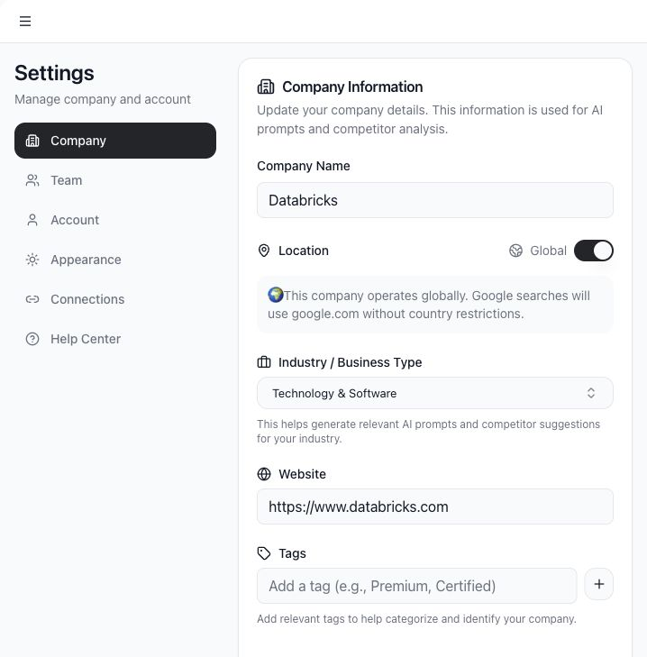
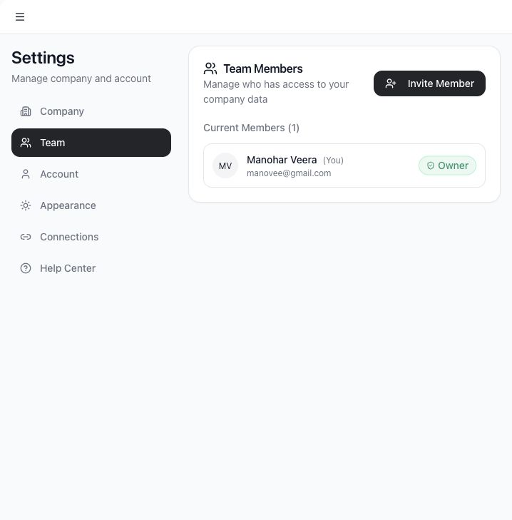
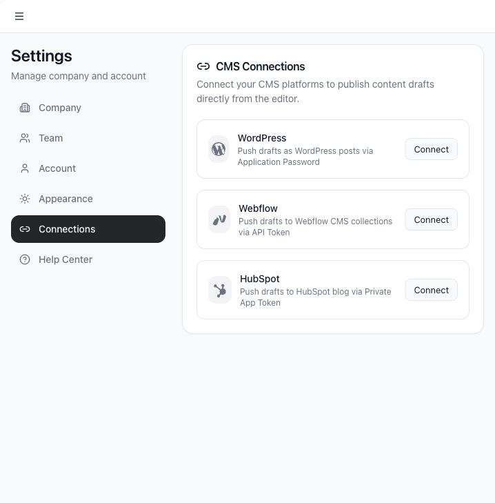
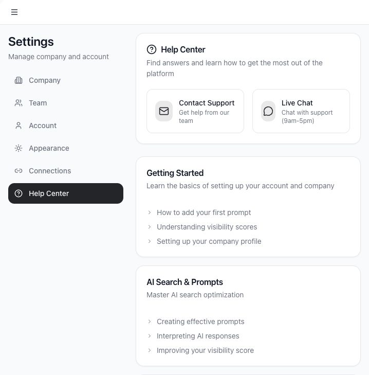

# Manage settings, team members, and CMS connections

Settings controls the company profile, team access, personal account details, appearance, CMS connections, and help resources.

## Use cases

- Update company name, location, industry, website, and brand tags.
- Invite team members.
- Change member roles.
- Update your profile.
- Switch theme appearance.
- Connect WordPress, Webflow, or HubSpot for publishing.
- Find help resources.

## Company settings

Use **Company** to update business details. These fields influence prompt generation, competitor suggestions, AI context, and search location behavior.

Important fields:

- **Company Name**: the name Tamlr searches for in AI answers.
- **Location**: used for location-aware prompts and search checks.
- **Global**: use this when the company should not be tied to one country.
- **Industry**: helps Tamlr generate relevant prompts and competitor ideas.
- **Website**: used for source classification and product discovery.
- **OEM or brand tags**: optional context for industry-specific analysis.

## Team settings

Use **Team** to manage workspace members and pending invites.

Admins can:

- Invite new members.
- Cancel pending invites.
- Extend an invite by resending it.
- Remove team members.
- Change member roles.

Owners cannot demote themselves directly. Transfer ownership first if ownership needs to change.

## Account settings

Use **Account** to update your profile details and sign out.

## Appearance

Use **Appearance** to change the app theme.

## CMS connections

Use **Connections** to connect external CMS platforms:

- WordPress via site URL, username, and application password.
- Webflow via API token, site ID, and collection ID.
- HubSpot via private app token.

Always test a connection before saving it. Saved connections are used when publishing content drafts from the editor.

## Help Center

Use **Help Center** for support and guidance. If a workflow is blocked, include the workspace, page, prompt, and approximate time when contacting support.

## Permissions and connection safety

- Only users with the right workspace role can invite members, remove members, or change roles.
- Company details affect prompts, source classification, products, and location-aware checks.
- CMS credentials should be created for publishing only and rotated if a team member loses access.
- Always test a CMS connection before relying on it for publishing.

If a teammate cannot access a setting, confirm their workspace role before troubleshooting further.
