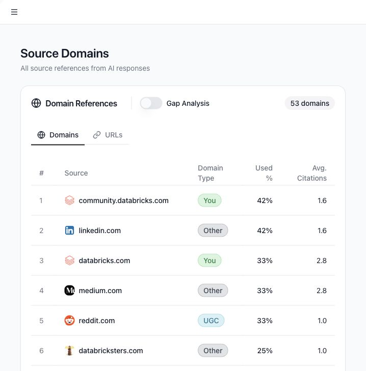

# Use Source Domains and gap analysis

Source Domains shows the websites and URLs that AI responses cite. It helps you understand which sources influence AI answers about your brand and where there may be coverage gaps.

## Use cases

- See which domains AI models cite most.
- Find whether your own site is being cited.
- Compare your sources with competitor sources.
- Identify high-opportunity domains where your brand is absent.
- Review URL-level source patterns.

## Open Source Domains

1. Select **Source Domains** in the sidebar.
2. Use the **Domains** tab for domain-level analysis.
3. Use the **URLs** tab for page-level analysis.

## Domain types

Tamlr classifies source domains into useful groups:

- **You**: the selected company's own domain.
- **Competitor**: a tracked competitor domain.
- **Corporate**: other corporate or brand domains.
- **UGC**: user-generated content and community sites.
- **Reference**: directory, marketplace, review, or reference sites.
- **Editorial**: media, publishing, or article sites.
- **Other**: sources that do not match another category.

## Gap analysis

Turn on **Gap Analysis** to focus on source opportunities. A gap usually means a source appears in AI answers but does not clearly mention or cite your brand. These are good candidates for content updates, outreach, listing improvements, or review/profile work.

## URL view

Use URL view when you need specific pages rather than domains. URL types can include homepages, category pages, product pages, articles, profiles, discussions, guides, listicles, and other page types.

## How Tamlr builds this view

- Tamlr looks at source links found in completed AI test responses.
- Your company website is marked separately from competitor websites and other source types.
- Domains are grouped so you can quickly separate owned sources, competitors, editorial sites, communities, directories, and other references.
- Gap analysis highlights sources that may influence AI answers but do not clearly include your brand.

Run fresh AI tests when you want Source Domains to reflect new content, new competitors, or recent market changes.
